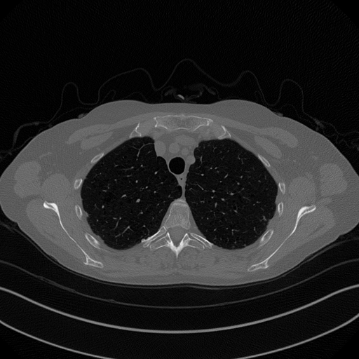

# DeepGuess
This is the Official GitHub repository for the paper: *Deep Guess acceleration for explainable image reconstruction in sparse-view CT*, by E. Morotti, D. Evangelista, E. Loli Piccolomini, from University of Bologna. Please consider citing us by the `bib` at the bottom of the present `README.md` file.

## Installation
To replicate the proposed experiments, just clone the Github repository by

```
git clone https://github.com/devangelista2/DeepGuess.git
cd DeepGuess
```

Please note that to run the experiments, the following packages are required:
- `pytorch`
- `tensorflow`
- `keras`
- `numpy`
- `numba`
- `astra-toolbox`
- `scikit-image`
- `PIL`
- `matplotlib`

All of the packages can be easily installed via `pip` or `conda`. Since our experiments make large use of `astra-toolbox`, it is also required to have access to a cuda-compatible graphics card. 

## Dataset
Our experiments have been performed on two datasets:
- The COULE dataset (available on Kaggle at https://www.kaggle.com/datasets/loiboresearchgroup/coule-dataset): consisting of 430 grey-scale images of dimension $256 \times 256$ representing ellipses of different contrast levels and small, high-contrasted dots, that imitates the human body structure, divided in 400 training images and 30 test images. More informations about the structure of the dataset is available at the link above.
- A slightly modified version of the Mayo's Clinic Dataset (https://cdas.cancer.gov/datasets/mayo/): consisting of 3305 grey-scale images of dimension $512 \times 512$, representing real anonymized CT reconstructions of human lungs from 10 patients.

It is thus required to download the two dataset to run the experiments. You can get COULE dataset from the link provided above, while the Mayo's Clinic Dataset is available at: https://drive.google.com/drive/folders/13BEiz6t57qSbwBpCtfqllmYTLmkhQeFE?usp=share_link.

<p align="center">
<figure>


<figcaption><i>Left:</i> A sample of COULE test data. <i>Right:</i> A sample of Mayo test data.</figcaption>
</figure>
</p>

## Code structure
The code is designed to be splitted into three main files, accessable from the root folder of the project:

- `train.py`
- `test.py`
- `generate_convergence.py`

The basic idea is the following (check the section below for the notation): the Deep Initial Guess (DIG) image is obtained by running a few iterations $K \in \mathbb{N}$ of an iterative algorithm (obtaining the $x_{pre}$ solution), and then applying a neural network trained on the convergence solutions of the same algorithm. The image obtained this way, known as $x_{DIG}$, is then used as an initial guess for an iterative algorithm solving the non-convex Total-$p$ Variation regularized problem. 

All the files listed above are self contained: it is sufficient to inspect them, modify the required parameters, and run the file to obtain the experiment's results. In particular, training the variants of RISING, requires pre-computing the convergence solutions of the required algorithm. 
This is done by considering the `generate_convergence.py` file and setting up the desired path.

## Pre-trained models
The weights files containing the pre-trained models used in the paper can be downloaded from: https://drive.google.com/drive/folders/11WLiUMYaDmPCghikjjCWguFKOqmCm-F-?usp=sharing.
By default, the file `test.py` expects the weights to be placed inside the `model_weights` folder. In particular, it is required copy inside the `model_weights` folder, the whole folder structure from Google Drive. For example, to save the weights for FBP-LPP method, applied on Mayo's Dataset, with Geometry $\mathcal{G}_{360, 360}$, the path is: `./model_weights/Mayo360_360/FBP_LPP/ResUNet.h5`.

## Methods
We briefly outline the proposed framework, to define the notations of the code. For a full description, please refer to the paper. We consider $x \in \mathbb{R}^n$ to be a grey-scale image representing the (unknown) image we want to reconstruct. Also, given an angular range $[start\_angle, end\_angle]$, discretized into `n_angles` uniformly distributed angles, we define the CT forward projector (with fan-beam geometry) $K \in \mathbb{R}^{m \times n}$ where $m = n_{angles} \cdot n_d$, $n_d$ being the number of pixel of the detector, which in the experiments is equal to $2\sqrt{n}$. The forward problem reads

```math
y^\delta = Kx + e.
```

Given $p \in (0, 1]$, we consider the regularized variational functional

```math
    \min_{x \geq 0} \frac{1}{2} || Kx - y^\delta ||_2^2 + \frac{\lambda}{p} || D x ||_{2, p}^p
```

where 

```math
    || D x ||_{2, p}^p = \sum_{i=1}^n \Bigl( \sqrt{(D_h x)_i^2 + (D_v x)_i^2} \Bigr)^p
```

is the isotropic Total-$p$ Variation operator of order $p>0$.

This problem can be solved by using the Chambolle-Pock (CP) algorithm with reweighting. But due to its non-convexity, it requires a good initial guess $x^{(0)}$. To do this, we provide a method (called Deep Guess), that considers a neural network trained as a post-processing operator, to compute an initial guess $x^{(0)}$ that is as close as possible to the convergence solution. We provide multiple choices for the algorithms to compute the Initial Guess. In particular, we always consider a pre-processing of the sinogram $x_{PRE} = \phi(y^\delta)$, which is then processed by a neural network to obtain $x_{DIG} = \Psi_\Theta(x_{PRE})$. The Chambolle-Pock iterative algorithm is then used with $x^{(0)} := x_{DIG}$.  

## Cite Us
The paper associated with this repository has been submitted to a journal. The BibTex to cite the paper will be available as soon as the paper will be published. 
